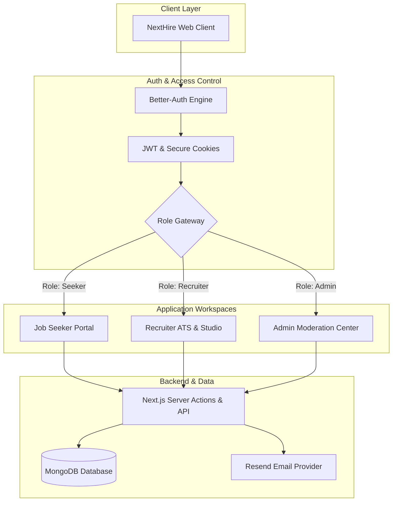

<div align="center">

# 🚀 NextHire

### The Modern Full-Stack Job Discovery & Talent Acquisition Platform

Empowering talent and recruiters with intelligent job search, end-to-end applicant tracking, and role-based hiring workflows.

[](https://nextjs.org/)
[](https://react.dev/)
[](https://tailwindcss.com/)
[](https://www.mongodb.com/)
[](https://better-auth.com/)
[](./LICENSE)

[Live Demo](#) • [Explore Features](#-core-features) • [Tech Stack](#-tech-stack) • [Getting Started](#-getting-started) • [Future Roadmap](#-future-roadmap)

---

</div>

## 📖 Table of Contents

- [About The Project](#-about-the-project)
  - [The Problem](#the-problem)
  - [The NextHire Solution](#the-nexthire-solution)
- [✨ Core Features](#-core-features)
  - [1. Granular Role-Based Access & Dynamic Workspaces](#1-granular-role-based-access--dynamic-workspaces-seeker-recruiter-admin)
  - [2. High-Performance Job Discovery & Multi-Faceted Search](#2-high-performance-job-discovery--multi-faceted-search)
  - [3. End-to-End ATS & Candidate Lifecycle Management](#3-end-to-end-ats--candidate-lifecycle-management)
  - [4. Dedicated Real-Time Dashboards & Visual Analytics](#4-dedicated-real-time-dashboards--visual-analytics)
  - [5. Secure Authentication Engine & Route Guarding](#5-secure-authentication-engine--route-guarding)
- [🛠️ Tech Stack](#️-tech-stack)
- [🏛️ System Architecture & Workflow](#️-system-architecture--workflow)
- [📁 Project Structure](#-project-structure)
- [🚦 Getting Started](#-getting-started)
  - [Prerequisites](#prerequisites)
  - [Environment Variables](#environment-variables)
  - [Installation & Setup](#installation--setup)
- [🔮 Future Roadmap: Plan & Tier Management](#-future-roadmap)
- [🤝 Contributing](#-contributing)
- [📄 License](#-license)

---

## 💡 About The Project

**NextHire** is an enterprise-ready, full-stack recruitment portal built with modern web architecture. It bridges the divide between passionate job seekers and high-growth companies by replacing fragmented, clunky hiring processes with a frictionless, unified talent marketplace.

### The Problem
Traditional job portals are riddled with disjointed user experiences, slow navigation, opaque application statuses, and manual candidate filtering. Employers struggle to track applicant pipelines effectively, while candidates are left waiting in silence without clarity on their application journey.

### The NextHire Solution
NextHire unifies discovery, application submission, candidate evaluation, company profiling, and administrative moderation into a single cohesive platform. Leveraging the **Next.js 16 App Router**, **React 19 Server Components**, **Better-Auth**, and **MongoDB**, NextHire delivers sub-second page transitions, robust access control, and dynamic role-tailored dashboards.

---

## ✨ Core Features

### 1. Granular Role-Based Access & Dynamic Workspaces (Seeker, Recruiter, Admin)
NextHire delivers customized, role-aware experiences across three distinct actor profiles:
- **👤 Job Seeker**: Manage professional profiles, upload resumes, save favorite listings, apply to vetted positions, and monitor status updates in real-time.
- **🏢 Recruiter**: Register and manage verified company profiles, post and manage job openings, view incoming candidate profiles, and drive applicant status transitions.
- **🛠️ Platform Admin**: Review and verify company registrations, moderate active job listings, oversee registered users, switch user roles, and inspect platform health metrics.

### 2. High-Performance Job Discovery & Multi-Faceted Search
A fast, server-rendered discovery engine designed to help candidates find the exact role suited to their career path:
- **Server-Side Filtering**: Filter instantly by job type (*Full-time, Part-time, Contract, Remote, Internship*), categories, posting recency, and sorting preferences.
- **Debounced Keyword Search**: Instant searching across job titles, company names, and technical requirements.
- **One-Click Application Flow**: Apply seamlessly with attached credentials, portfolio links, and customized cover notes.
- **Saved Opportunities**: Bookmark promising roles to a dedicated repository for rapid retrieval and comparison.

### 3. End-to-End ATS & Candidate Lifecycle Management
A structured hiring pipeline that eliminates email clutter and manual spreadsheets:
- **Applicant Tracking Workflow**: Recruiters manage applicants through a clear status lifecycle:
  $$\text{Applied} \longrightarrow \text{Under Review} \longrightarrow \text{Shortlisted} \longrightarrow \text{Offered / Rejected}$$
- **Direct Candidate Evaluation**: Review applicants per job post with direct resume access, submission timestamps, and profile summaries.
- **Company Verification Pipeline**: Multi-step employer onboarding ensuring all company profiles pass administrative scrutiny before publishing open roles.

### 4. Dedicated Real-Time Dashboards & Visual Analytics
Purpose-built dashboards equipped with responsive metrics and charts:
- **Seeker Dashboard**: High-level counters for submitted applications, saved listings, scheduled interviews, and visual breakdown of application statuses.
- **Recruiter Dashboard**: Metric cards for active jobs, total applications, hiring rates, and recent candidate activity feeds.
- **Admin Dashboard**: Comprehensive platform insights powered by **Recharts**, tracking 6-month user acquisition curves, job category distribution, active companies, and system activity logs.

### 5. Secure Authentication Engine & Route Guarding
Enterprise-level security powered by **Better-Auth** and MongoDB:
- **Hybrid Authentication**: Dual support for credential-based authentication (email/password with secure password hashing) and **Google OAuth**.
- **Session & Token Management**: JWT-backed sessions with secure HTTP-only cookie caching and low-latency token rotation.
- **Route Protection & Gateways**: Server-side proxy and layout guards preventing unauthorized role access (`/unauthorized` and `/forbidden` redirects).
- **Email Verification Ready**: Integrated with **Resend** for transaction-based email delivery and verification links.

---

## 🛠️ Tech Stack

| Category | Technology | Description |
| :--- | :--- | :--- |
| **Framework** | **Next.js 16** (App Router) | Utilizing Server Components, Server Actions, Dynamic Routes, and SEO Metadata |
| **UI Library** | **React 19** | Concurrent features, optimized hydration, and modern hooks |
| **Styling & Design** | **Tailwind CSS v4** + **HeroUI** | Utility-first styling with modern dark-mode aesthetics and fluid animations |
| **Motion & Icons** | **Framer Motion** + **Lucide / React Icons** | Smooth micro-interactions and iconography |
| **Authentication** | **Better-Auth** + **MongoDB Adapter** | RBAC, JWT session handling, Google OAuth, and secure credential storage |
| **Database** | **MongoDB** (Native Driver v7) | High-performance document database with flexible schemas |
| **Data Visualization** | **Recharts** | Interactive charts for hiring pipelines, user growth, and job analytics |
| **Notifications** | **React Hot Toast** | Non-intrusive, reactive toast notifications for instant UX feedback |
| **Email Service** | **Resend** | Transactional email workflows for verification and notification triggers |

---

## 🏛️ System Architecture & Workflow



---

## 📁 Project Structure

```text
nexthire/
├── src/
│   ├── app/
│   │   ├── (auth)/                # Authentication routes (Sign-in, Sign-up, Verification)
│   │   ├── (public)/              # Public & protected feature pages
│   │   │   ├── browse-jobs/       # Job exploration, search, and job details
│   │   │   ├── companies/         # Company directory & profile view
│   │   │   ├── pricing/           # Tiered plans & subscription breakdown
│   │   │   ├── dashboard/         # Role-specific workspaces
│   │   │   │   ├── seeker/        # Seeker dashboard, saved jobs, applications, settings
│   │   │   │   ├── recruiter/     # Recruiter dashboard, job manager, company setup, applicants
│   │   │   │   └── admin/         # Platform admin overview, user control, job moderation
│   │   ├── api/                   # Better-auth API handlers
│   │   ├── layout.jsx             # Root layout with font & toast configurations
│   │   ├── error.js               # Global error boundaries
│   │   └── loading.js             # Global loading fallbacks
│   ├── components/                # Modular UI components (Dashboard, Home, Browse, Shared)
│   ├── hooks/                     # Custom client-side utility hooks
│   ├── lib/
│   │   ├── actions/               # Next.js Server Actions
│   │   ├── api/                   # Role-specific API connectors & fetch wrappers
│   │   ├── core/                  # Protected fetch helpers, session extractors, server managers
│   │   ├── auth.js                # Better-auth server configuration & MongoDB adapter
│   │   └── metadata.js            # Dynamic OpenGraph & SEO metadata generator
│   └── proxy.js                   # Server-side routing & dashboard route protection
├── public/                        # Static assets, logos, and icons
└── package.json                   # Dependencies and build scripts
```

---

## 🚦 Getting Started

### Prerequisites
Make sure you have installed:
- **Node.js**: `v18.18.0` or later (Node.js 20+ recommended)
- **npm**, **yarn**, or **pnpm**
- **MongoDB**: A running local MongoDB instance or a [MongoDB Atlas](https://www.mongodb.com/atlas) cluster

### Environment Variables
Create a `.env` file in the root directory and configure the following variables:

```env
# Next.js Public Configuration
NEXT_PUBLIC_BASE_URL=http://localhost:3000

# MongoDB Database Connection
MONGODB_URI=mongodb+srv://<username>:<password>@cluster0.mongodb.net/
MONGODB_DB_NAME=nexthire

# Better-Auth Configuration
BETTER_AUTH_SECRET=your_super_secret_better_auth_key
BETTER_AUTH_URL=http://localhost:3000

# Google OAuth Credentials (Optional for Social Login)
GOOGLE_CLIENT_ID=your_google_client_id
GOOGLE_CLIENT_SECRET=your_google_client_secret

# Resend Email Service
RESEND_API_KEY=re_your_resend_api_key
```

### Installation & Setup

1. **Clone the repository**:
   ```bash
   git clone https://github.com/your-username/nexthire.git
   cd nexthire
   ```

2. **Install dependencies**:
   ```bash
   npm install
   ```

3. **Run the development server**:
   ```bash
   npm run dev
   ```

4. **Open the application**:
   Visit [http://localhost:3000](http://localhost:3000) in your browser.

5. **Build for production**:
   ```bash
   npm run build
   npm run start
   ```

---

## 🔮 Future Roadmap: Plan & Tier Management

The primary strategic milestone for NextHire is the implementation of an **End-to-End Subscription & Plan Management Engine** for both **Seekers** and **Recruiters**.

### 💼 Plan Matrix & Quota Enforcement

```text
┌────────────────────────────────────────────────────────────────────────────┐
│                             NEXTHIRE PLANS                                 │
├─────────────────────────────────────┬──────────────────────────────────────┤
│          FOR JOB SEEKERS            │            FOR RECRUITERS            │
├─────────────────────────────────────┼──────────────────────────────────────┤
│ 🟢 Free:                            │ 🟢 Free:                             │
│   • 3 job applications / month      │   • Up to 3 active job posts         │
│   • 10 saved listings               │   • Basic applicant management       │
│                                     │                                      │
│ 🔵 Pro ($19/mo):                    │ 🔵 Growth ($49/mo):                  │
│   • 30 job applications / month     │   • Up to 10 active job posts        │
│   • Unlimited saved listings        │   • Candidate tracking & analytics   │
│   • Salary insights & tracking      │   • Standard candidate search        │
│                                     │                                      │
│ 🟣 Premium ($39/mo):                │ 🟣 Enterprise ($149/mo):             │
│   • Unlimited applications          │   • Up to 50 active job posts        │
│   • Candidate Spotlight boost       │   • Featured job badges              │
│   • Early access to new listings    │   • Custom employer branding         │
│   • Priority recruiter visibility   │   • Dedicated hiring analytics       │
└─────────────────────────────────────┴──────────────────────────────────────┘
```


## 🤝 Contributing

Contributions make the open-source community an incredible place to learn, inspire, and create. Any contributions you make are **greatly appreciated**.

1. Fork the Project
2. Create your Feature Branch (`git checkout -b feature/AmazingFeature`)
3. Commit your Changes (`git commit -m 'Add some AmazingFeature'`)
4. Push to the Branch (`git push origin feature/AmazingFeature`)
5. Open a Pull Request

---

## 📄 License

Distributed under the MIT License. See `LICENSE` for more information.

---

<div align="center">
  <sub>Built with ❤️ by the <a href='https://riad-ahmed-dev.vercel.app'>Riad Ahmed</a>. Star ⭐ this repository if you found it inspiring!</sub>
</div>
